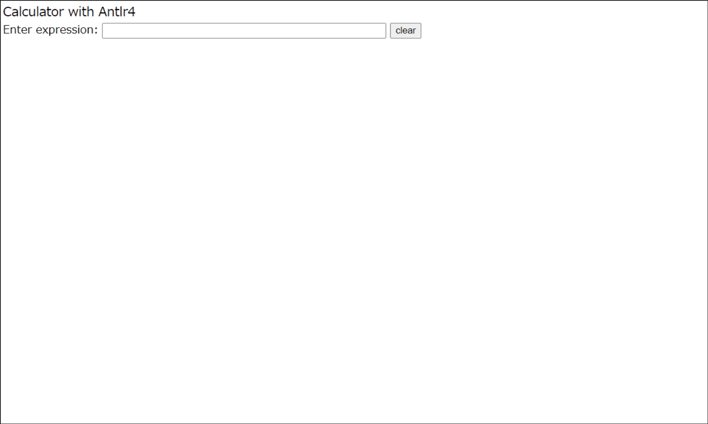

<!-- Some examples of the JavaScript target (example with Webpack,  JSON to XML translator) -->

## antlr4 JavaScript examples  

### What is ANTLR4 

[ANTLR4](http://www.antlr.org) is a parser generator.


### Demo  

Open 02_Calculator2/dist/index.html in your browser




### Requirement   

- [Node.js](https://nodejs.org/en/) (installed `C:\Program Files\nodejs\node.exe`)  
- java
- [ANTLR 4.8 Java binaries jar](https://www.antlr.org/download.html)  
Make C:\Javalib and save antlr-4.8-complete.jar in C:/Javalib.
- JavaScript runtime lib [antlr-javascript-runtime-4.8.zip](https://www.antlr.org/download.html)  
unzip it (created folder antlr4)  
- Open  `Dos Command Prompt`  
`$ cd C:/...../antlr4`  
`$ npm -g install antlr4`  
`set System variables: NODE_PATH C:\Users\-user name-\AppData\Roaming\npm\node_modules`  

### 01_Calculator1 (first example)

Expr1.g4
```antlr
grammar Expr1;

stat : expr EOF;

expr : <assoc=right> expr '^' expr # Expo
     | expr '*' expr               # Mult
     | expr '+'  expr              # Add
     | INT                         # Int
     ;

INT : [0-9]+ ;
WS : [ \t\n\r]+ -> skip ;
```  

```
$ cd C:/.../01_Calculator1
$ java.exe -jar C:/Javalib/antlr-4.8-complete.jar -Dlanguage=JavaScript -o gen Expr1.g4
$ node.exe calculator1.js
```


output  
```
Tokens:[@tokenIndex,start:stop='text',<type>(,channel=nr),line:column]
[@0,0:2='100',<4>,1:0]
[@1,3:3='+',<3>,1:3]
[@2,4:4='3',<4>,1:4]
[@3,5:5='*',<2>,1:5]
[@4,6:6='4',<4>,1:6]
[@5,7:7='+',<3>,1:7]
[@6,8:8='2',<4>,1:8]
[@7,9:9='^',<1>,1:9]
[@8,10:10='3',<4>,1:10]
[@9,11:11='^',<1>,1:11]
[@10,12:12='2',<4>,1:12]
[@11,13:12='<EOF>',<-1>,1:13]

Parse tree (Lisp format):
(stat 
   (expr 
      (expr 
         (expr 100) + 
         (expr 
            (expr 3) * 
            (expr 4))) + 
      (expr 
         (expr 2) ^ 
         (expr 
            (expr 3) ^ 
            (expr 2)))) <EOF>)

result:
100+3*4+2^3^2=624


(node:17124) Warning: ...
...
```


### 02_Calculator2  

Example with Webpack  
See DEMO

Expr2.g4
```antlr
grammar Expr2;

stat : expr EOF;

expr:  <assoc=right> expr '^' expr # expo
    |  expr op=('*'|'/') expr      # mul_div
    |  op=('+'|'-') expr           # pm_expr
    |  expr op=('+'|'-') expr      # add_sub
    |  FLOAT                       # float
    |  INT                         # integer
    |  '(' expr ')'                # paren
    ;

FLOAT:  DIGIT*  '.' DIGIT+ ;
INT : DIGIT+ ;
fragment DIGIT: [0-9] ;
WS : [ \t\n\r]+ -> skip ;
```  


After the Webpack build task is executed, the file structure should look as follows: 

```
02_Calculator2
 │ 
 ├─ dist
 │  ├─ index.html
 │  └─ bundle_calculator2.js 
 │
 ├─ node_modules
 │      └─.bin,.... , antlr4,...., yargs-parser
 │ 
 ├─ src
 │  ├─ test_calculator2.js
 │  ├─ Expr2.g4
 │  └─ gen
 │      └─Expr2.interp,... , Expr2Parser.js, Expr2Visitor.js
 │ 
 ├─ package.json
 ├─ package-lock.json
 └─ webpack.config.js

```


- Open  `Dos Command Prompt`  

```
$ cd C:/.../antlr4_JavaScript_examples/02_Calculator2/src
$ java.exe -jar C:/Javalib/antlr-4.8-complete.jar -Dlanguage=JavaScript -visitor -no-listener -o gen Expr2.g4
```

- Create package.json  


```
$ cd ..
$ npm init -y
```

- Create a new file named webpack.config.js defined as follows:  

webpack.config.js  
```
const path = require('path');

module.exports = {
  mode: 'development',
    entry: './src/calculator2.js',
    output: {
        path: path.join(__dirname, 'dist/js'),
        filename: 'bundle_calculator2.js'
    },
    node:{ module: "empty", 
        net: "empty", 
        fs: "empty" }
};

```

- Install webpack and webpack-cli modules 
 
```
$ npm install --save-dev webpack webpack-cli
```

- Copy folder antlr4, then paste it into node_modules  
- Bundle up calculator2.js and antlr4, make bundle_calculator2.js  

```
$ npx webpack
```

- Open 02_Calculator2/dist/index.html in your browser


### 03_Json2xml  

JSON to XML translator  

Json.g4
```antlr
// Derived from http://json.org

grammar Json;

json:   element
    ;

element
    :   value
    ;

value
    :   object      # ObjectValue
    |   array       # ArrayValue
    |   STRING      # String
    |   NUMBER      # Atom
    |   'true'      # Atom
    |   'false'     # Atom
    |   'null'      # Atom
    ;

object
    :   '{' '}'                         # EmptyObject
    |   '{' member (',' member)*  '}'   # AnObject
    ;

array
    :   '[' ']'                          # EmptyArray
    |   '[' element (',' element)* ']'   # ArrayOfValues
    ;

member: STRING ':' element
    ;


LCURLY : '{' ;
LBRACK : '[' ;
STRING :  '"' (ESC | ~["\\])* '"' ;

fragment ESC :   '\\' (["\\/bfnrt] | UNICODE) ;
fragment UNICODE : 'u' HEX HEX HEX HEX ;
fragment HEX : [0-9a-fA-F] ;

NUMBER
    :   '-'? INT '.' INT EXP?   // 1.35, 1.35E-9, 0.3, -4.5
    |   '-'? INT EXP            // 1e10 -3e4
    |   '-'? INT                // -3, 45
    ;
fragment INT :   '0' | '1'..'9' '0'..'9'* ; // no leading zeros
fragment EXP :   [Ee] [+\-]? INT ; // \- since - means "range" inside [...]

WS  :   [ \t\n\r]+ -> skip ;
```  


```
$ cd C:/.../03_Json2xml
$ java.exe -jar C:/Javalib/antlr-4.8-complete.jar -Dlanguage=JavaScript -o gen Json.g4
$ node.exe json2xml.js
```


JSON file (test.json)  

```json 
{
    "description" : "An imaginary server config file",
    "logs" : {"level":"verbose", "dir":"/var/log"},
    "host" : "antlr.org",
    "admin": ["parrt", "tombu"],
    "aliases": [],
    "tag1": [{"tag2": 1.4142}, {"tag3": {"tag4": [true, false, null]}}]
}

```

&emsp;&emsp;&darr;

XML file
```
<description>An imaginary server config file</description>
<logs>
   <level>verbose</level>
   <dir>/var/log</dir>
</logs>
<host>antlr.org</host>
<admin>
   <element>parrt</element>
   <element>tombu</element>
</admin>
<aliases></aliases>
<tag1>
   <element>
      <tag2>1.4142</tag2>
   </element>
   <element>
      <tag3>
         <tag4>
            <element>true</element>
            <element>false</element>
            <element>null</element>
         </tag4>
      </tag3>
   </element>
</tag1>
```
